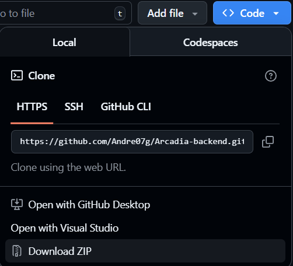
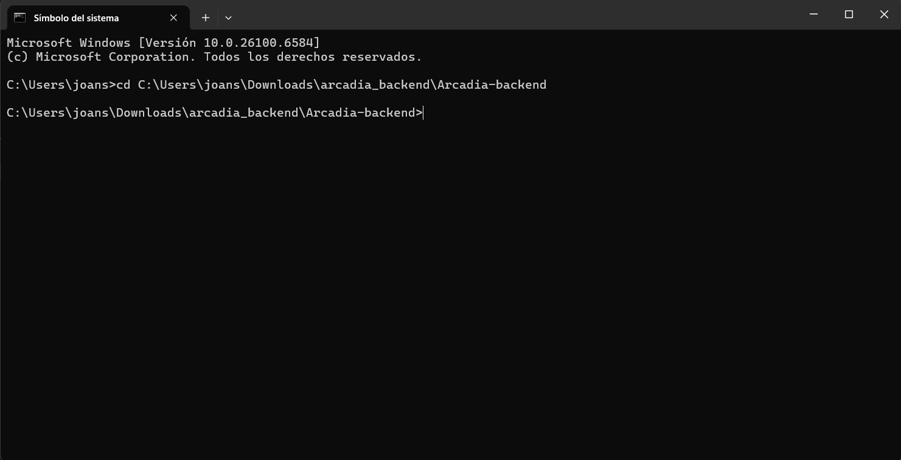
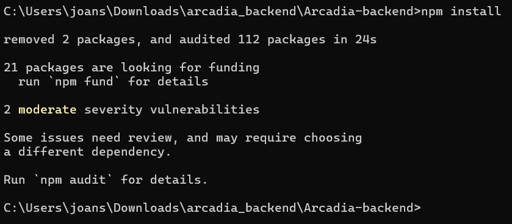
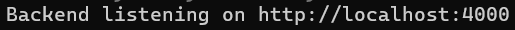

# 🎮 Arcadia: The Best Video Game Site - BACKEND 🕹️

<p align="center">
  
</p>

version: 1.0.0

Arcadia is your ultimate destination in the gaming galaxy. More than a simple platform, we are a vibrant community and a resource hub designed by and for passionate gamers like you. Forget searching in a thousand places: here you have immediate access to the most relevant of the gaming universe.

*This repository contains the backend for Arcadia.*

## ✨ Key Management Features

We have centralized the tools needed to manage the game catalog and the sales process efficiently and securely.

### 🎮 Full Video Game Catalog Management
The platform gives you full control over your digital inventory, allowing you to keep the game database always up to date and accurate:

- 📝 **Create Games:** Quickly add new titles to the catalog including full details (description, genre, platforms, etc.).
- ✏️ **Edit:** Update information for any existing game (price changes, description corrections, adding patches, etc.).
- 🗑️ **Delete:** Permanently remove obsolete or unavailable games from the database.
- 🔍 **List (CRUD):** View the complete game catalog for quick audits and locating titles.

### 🛒 Efficient Sales Management
We simplify the workflow to record and manage customer transactions:

- 💰 **Create Sales:** Generate detailed sales records for customers who purchase games, ensuring accurate tracking of each transaction.
- 💻 **View Sales:** History of completed sales as receipts, with items, total, and the purchasing customer.
- 🗑️ **Delete Sales:** Remove recorded sales.

## 🛠️ Technologies Used

<p align="center">
  <a href="https://nodejs.org/" target="_blank" rel="noreferrer">
    
  </a>
  <a href="https://expressjs.com/" target="_blank" rel="noreferrer">
    
  </a>
  <a href="https://www.mongodb.com/" target="_blank" rel="noreferrer">
    
  </a>
</p>

<br>

## Environment variables

Create a .env file in the project root with the following variables (replace values as needed):

```env
MONGO_URI=your_mongo_connection_string
DB_NAME=arcadia_db
PORT=4000
HOST_NAME=localhost
APIVERSION=v1
MIN_RANGE=0
```

Notes:
- MONGO_URI: MongoDB connection URI.
- DB_NAME: Database name to use.
- PORT: Server port (default 4000).
- HOST_NAME: Hostname or IP (e.g., localhost).
- APIVERSION: API version string (e.g., v1).
- MIN_RANGE: Minimum allowed range value used by the app.

## 🔌 Installation

To install the backend developed and used by ARCADIA, follow these steps:

1. Go to the repository where the backend is hosted: https://github.com/Andre07g/Arcadia-backend
2. On the repository page, click the `Code` button.
3. Click *Download ZIP*.

<p align="center">
  
</p>

4. Once the ZIP file has been downloaded, unzip it.

5. After extracting, open a CMD terminal and navigate to the folder where the extracted directory is located:

<p align="center">
  
</p>

6. Install the required dependencies with `npm install`

<p align="center">
  
</p>


7. Start the backend with `npm run dev`

<p align="center">
  
</p>

The backend should now be running correctly

## Endpoints used

The following shows the endpoints used in the backend and how they work.

### Create videogame

**Method:** `POST`

**Endpoint:** 

```bash
localhost:4000/videogames
```

**Result:**

```json
{
    "message": "Game created successfully"
}
```

<br>

### Get videogames

**Method:** `GET`

**Endpoint:** 

```bash
localhost:4000/videogames
```

**Result:**

```json
[
    {
        "_id": "68f1c93354364f337476e8b6",
        "title": "Cosmic Odyssey: Starfall",
        "genre": "Science Fiction RPG",
        "platform": "PC",
        "description": "An epic space adventure where you explore uncharted galaxies, make crucial moral decisions, and lead a team against an ancient cosmic threat.",
        "price": 5999,
        "image": "https://arcadia-games.com/images/cosmic-odyssey-starfall.jpg",
        "stock": 150
    }
]
```

<br>

### Edit videogame

**Method:** `PATCH`

**Endpoint:** 

```bash
localhost:4000/videogames/68f1ca2c54364f337476e8b7
```

**Result:**

```json
{
    "message": "Game modified"
}
```

### Delete videogame

**Method:** `DELETE`

**Endpoint:** 

```bash
localhost:4000/videogames/68f1ca2c54364f337476e8b7
```

**Result:**

```json
{
    "message": "Game was deleted"
}
```

---

### Create sale

**Method:** `POST`

**Endpoint:** 

```bash
localhost:4000/sales
```

**Result:**

```json
{
    "message": "Game created successfully"
}
```

<br>

### View sales

**Method:** `GET`

```bash
localhost:4000/sales
```

**Result:**

```json
{
    "message": "Sale created successfully",
    "sale": {
        "date": "2025-10-17T12:00:00.000Z",
        "client": "Aurelio González",
        "products": [
            {
                "gameId": "653b6f1e5e9f8a2f4c3a2b1d",
                "nombre": "Cosmic Odyssey: Starfall",
                "precio": 5999,
                "cantidad": 1
            },
            {
                "gameId": "653b6f1e5e9f8a2f4c3a2b1e",
                "nombre": "Speed Racer X",
                "precio": 3499,
                "cantidad": 2
            }
        ],
        "total": 12997,
        "_id": "68f1ce6c54364f337476e8b8"
    }
}
```

## 🎨 Frontend repository link

<p align="center">
  <a href="https://github.com/Andre07g/Arcadia-front-end" target="_blank" rel="noopener noreferrer">
    
  </a>
</p>


<p align="center">
  <a href="https://github.com/Andre07g/Arcadia-front-end" target="_blank" rel="noopener noreferrer">https://github.com/Andre07g/Arcadia-front-end</a>
</p>

## Video demo — BACKEND

<p align="center">
  <a href="https://drive.google.com/file/d/1kUWlkTjag5Y-DgLmQEm1ZSLmVO0Bz-UH/view?usp=sharing" target="_blank" rel="noopener noreferrer">
    
  </a>
</p>

<p align="center">
  <a href="https://drive.google.com/file/d/1kUWlkTjag5Y-DgLmQEm1ZSLmVO0Bz-UH/view?usp=sharing" target="_blank" rel="noopener noreferrer">Open the Backend demo on Google Drive</a>
</p>

## Video demo — FULLSTACK

<p align="center">
  <a href="https://drive.google.com/file/d/13ITnhHI2zBhraZY30Fml1GNSei4ZxfTs/view?usp=sharing" target="_blank" rel="noopener noreferrer">
    
  </a>
</p>

<p align="center">
  <a href="https://drive.google.com/file/d/13ITnhHI2zBhraZY30Fml1GNSei4ZxfTs/view?usp=sharing" target="_blank" rel="noopener noreferrer">Open the Fullstack demo on Google Drive</a>
</p>

## 🧑‍🦱 Authors

- **Joan Sebastián Gómez Serrano**
- **Edgar Leal**
- **Karolain Reyes**
- **Michel Rodriguez**