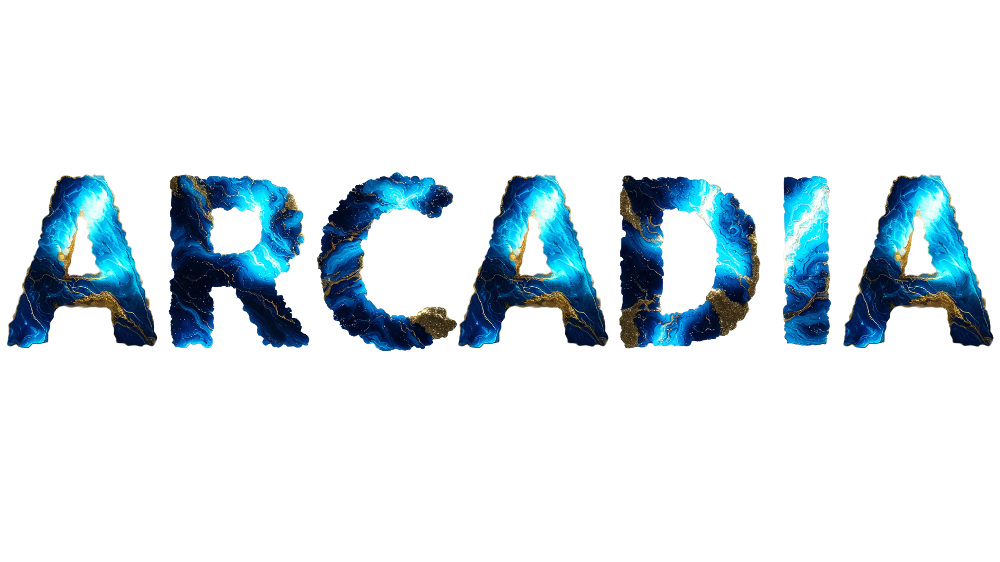

# 🎮 Arcadia: El Mejor Sitio de Videojuegos - BACKEND 🕹️

Arcadia es tu destino definitivo en la galaxia del gaming. Más que una simple plataforma, somos una comunidad vibrante y un centro de recursos diseñado por y para apasionados jugadores como tú. Olvídate de buscar en mil lugares: aquí tienes acceso inmediato a lo más relevante del universo gamer.

*Actualmente se encuentra en el repositorio donde se ubica el backend de arcadia*

## ✨ Funcionalidades Clave de Gestión

Hemos centralizado las herramientas necesarias para manejar el catálogo de juegos y el proceso de ventas de manera eficiente y segura.

### 🎮 Gestión Completa del Catálogo de Videojuegos
La plataforma te da control total sobre tu inventario digital, permitiéndote mantener la base de datos de juegos siempre actualizada y precisa:

- 📝 **Creación de Videojuegos:** Agrega nuevos títulos al catálogo de forma rápida, incluyendo todos sus detalles (descripción, género, plataformas, etc.).

- ✏️ **Edición:** Actualiza la información de cualquier juego existente (cambios de precio, correcciones de descripción, adición de parches, etc.).

- 🗑️ **Eliminación:** Retira juegos obsoletos o no disponibles de la base de datos de manera definitiva.

- 🔍 **Listado (CRUD):** Visualiza el catálogo completo de juegos para una rápida auditoría y localización de títulos.

### 🛒 Gestión Eficiente de Ventas
Simplificamos el flujo de trabajo para registrar y administrar las transacciones de los clientes:

- 💰 **Creación de Ventas:** Genera registros de venta detallados para los clientes que adquieran videojuegos, asegurando un seguimiento preciso de cada transacción.

- 💻**Visualizar ventas:** Historial de las ventas realizadas como recibos, con sus items, total y el cliente que lo compra.

- 🗑️ **Eliminar ventas:** Eliminación de las ventas realizadas.

